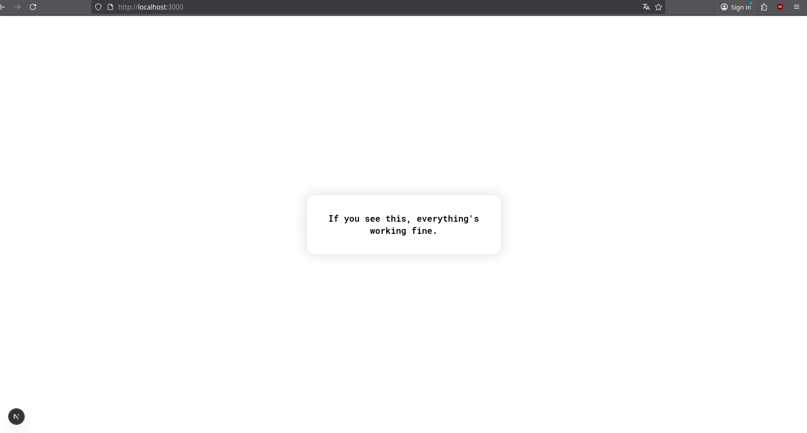
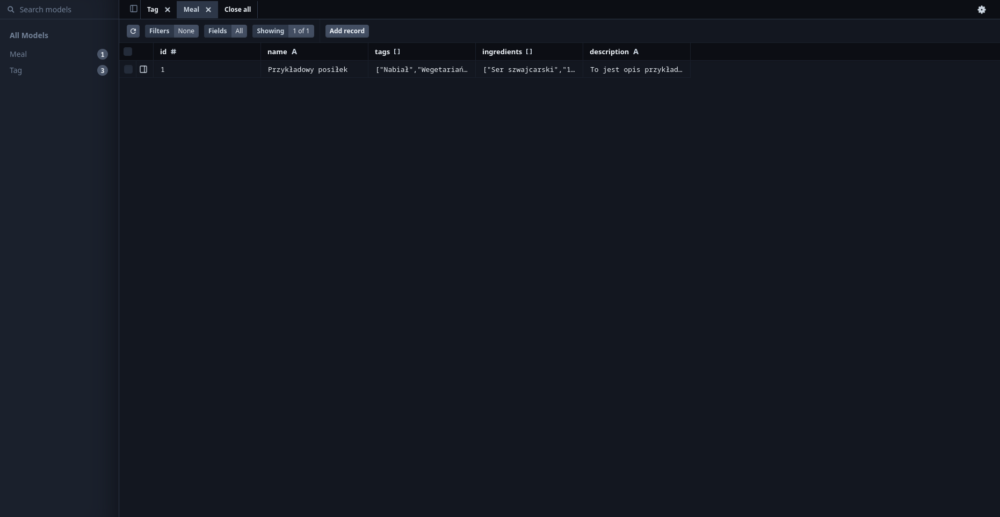
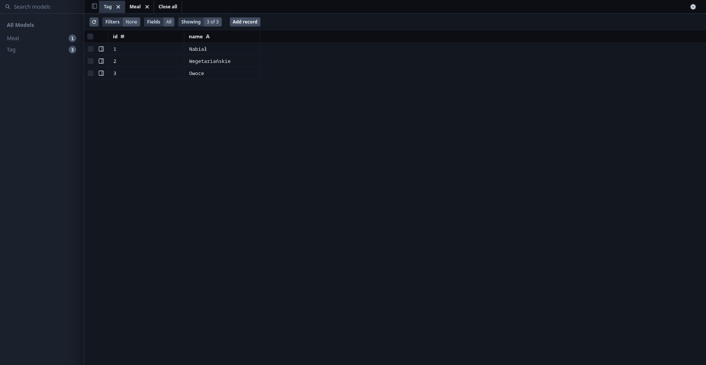

# SmartMenu

## Setup

### Uruchomienie aplikacji

1. Po pobraniu kodu należy pobrać wszystkie zależności:
```bash
$ npm i
```

2. Następnie można włączyć serwer:
```bash
$ npm run dev
```

3. Wejdź na http://localhost:3000

4. Jeżeli masz przed sobą taki widok to znaczy, że wszystko działa poprawnie.



### Utworzenie bazy danych

Aplikacja korzysta z bazy danych Postgresql, dlatego upewnij się, że masz ją zainstalowaną.

1. Skopiuj plik `.env.example`
2. W kluczu `DATABASE_URL` zamień `user` i `password` na nazwę użytkownika oraz hasło do Twojej bazy danych Postgresql. Możesz też na samym końcu zmienić `schema=smartmenu` na inną schemę, np. `schema=twoja-stara-baza-danych` czy coś.
3. Wrzuć obecny stan schemy do bazy danych: `npx prisma db push`
4. Wpisz `npx prisma generate` - to Ci wygeneruje różne klasy do obsługi Prismy.
5. Zaseeduj sobie bazę: `npx prisma db seed`.
6. Sprawdź czy dane wrzuciły się do bazy danych poprawnie: `npx prisma studio`. 

Jeżeli wszystko poszło dobrze to tak powinna wyglądać Twoja baza po zaseedowaniu:




## Wskazówki rozwojowe

### Dodawania lub zmienianie pól w tabelach w bazie danych

1. Edytujesz plik `prisma/schema.prisma`
2. Wpisujesz komendę `npx prisma migrate dev --name <nazwa migracji>`
3. Migracja sama się wykonuje. Aby upewnić się, że wszystko zadziałało normalnie użyj komendy `npx prisma db pull` - pobiera ona aktualną schemę z bazy danych i nadpisuje plik `schema.prisma`. Jeżeli wszystko jest ok to zawartość pliku się nie zmieni (za wyjątkiem np. innej kolejności tabel).
